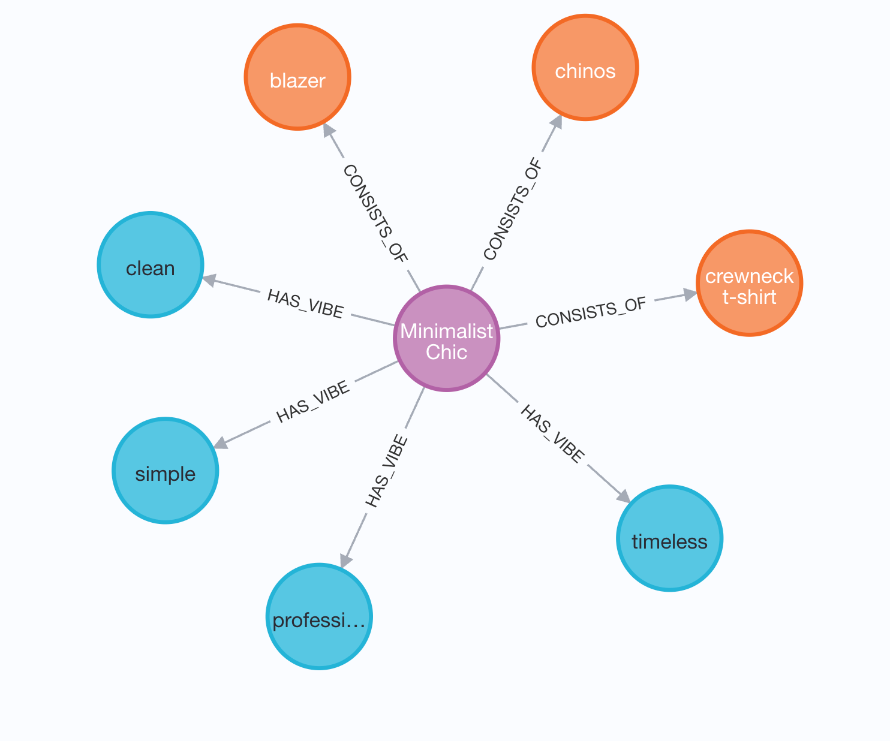

# StyleSync - AI Fashion Styling Assistant

An AI-powered fashion styling application that transforms fashion trends into personalized outfit recommendations using knowledge graphs and vector databases.

## 🎯 What It Does

StyleSync generates personalized outfit recommendations by:
1. **Analyzing fashion trends** using Neo4j knowledge graphs
2. **Finding matching clothes** using Weaviate semantic search
3. **Creating style boards** with AI-generated outfit images

## 🏗️ Database Architecture

### Neo4j - Fashion Knowledge Graph
**Use Case**: Stores and analyzes fashion trend relationships

- **Nodes**: Trends, Garments, Vibes
- **Relationships**: `CONSISTS_OF` (Trend → Garment), `HAS_VIBE` (Trend → Vibe)
- **Query Example**: Find all garments and vibes for "90s Revival" trend
```cypher
MATCH (t:Trend {name: "90s Revival"})-[:CONSISTS_OF]->(g:Garment),
      (t)-[:HAS_VIBE]->(v:Vibe)
RETURN collect(g.name) as garments, collect(v.name) as vibes
```

### Weaviate - Semantic Wardrobe Search
**Use Case**: Vector-based semantic matching of clothing items

- **Schema**: ClothingItem class with vectorized descriptions
- **Search**: Finds clothes matching trend DNA using semantic similarity
- **Filtering**: Separates tops and bottoms with precise type filtering
- **Scoring**: Custom matching algorithm based on garments and vibes

## 🚀 Quick Start

### Prerequisites
- Python 3.8+
- Docker (for databases)
- Neo4j and Weaviate instances

### Setup
```bash
# Clone and install
git clone <repository>
cd styleSync
pip install -r requirements.txt

# Configure environment
cp .env.example .env
# Edit .env with your database credentials and API keys

# Start databases with Docker
docker run -d --name neo4j -p 7474:7474 -p 7687:7687 \
  -e NEO4J_AUTH=neo4j/your_password neo4j:latest

docker run -d --name weaviate -p 8080:8080 \
  -e AUTHENTICATION_ANONYMOUS_ACCESS_ENABLED=true \
  semitechnologies/weaviate:latest

# Seed databases with sample data
python seed_databases.py

# Run application
python run.py
```

Visit `http://127.0.0.1:5000` to start styling!

## 🔧 Tech Stack

- **Backend**: Python Flask
- **Knowledge Graph**: Neo4j (trend relationships)
- **Vector Database**: Weaviate (semantic clothing search)
- **AI**: Google Gemini (image generation)
- **Frontend**: HTML/CSS/JavaScript

## 📊 How It Works

### The AI Workflow

1. **Trend DNA Analysis** (Neo4j)
   - User selects a fashion trend
   - System queries Neo4j for trend components (garments + vibes)
   - Example: "90s Revival" → [`denim jeans`, `graphic t-shirt`] + [`grunge`, `casual`]
   - 

2. **Semantic Wardrobe Search** (Weaviate)
   - Creates search concept from trend DNA
   - Performs vector similarity search for matching clothes
   - Separates and scores tops vs bottoms
   - Returns best matching items from user's wardrobe

3. **Style Board Generation**
   - Combines matched clothes with trend aesthetics
   - Generates AI outfit image using Gemini
   - Returns complete style recommendation

### Sample Data

**Neo4j Trends**:
- `90s Revival`: denim jeans, graphic t-shirt → grunge, casual, streetwear
- `Minimalist Chic`: crewneck t-shirt, chinos → clean, simple, professional

**Weaviate Wardrobe**:
- White cotton t-shirt (casual, basic, minimalist)
- Black oversized hoodie (streetwear, casual, cozy)
- Dark wash denim jeans (casual, classic, streetwear)

## 🛠️ Project Structure

```
styleSync/
├── app/
│   ├── agent.py          # AI workflow orchestration
│   ├── db_seeder.py      # Database seeding utilities  
│   └── routes.py         # Flask API endpoints
├── templates/index.html  # Frontend interface
├── static/style.css      # Styling
├── run.py               # Application entry point
└── seed_databases.py    # Database initialization
```

## 🧪 Testing

```bash
# Test database connections
python test_weaviate.py
python -c "from app.agent import generate_style_board; print('✅ Ready!')"

# Run full workflow test
python test_agent.py
```

## 📈 Status

✅ **Production Ready** - Complete MVP with all core features implemented
- Neo4j knowledge graph with trend relationships
- Weaviate semantic search with custom scoring
- AI agent workflow orchestration
- Modern web interface
- Comprehensive error handling

---

**StyleSync** - Where fashion trends meet personalized AI styling 🎨✨
